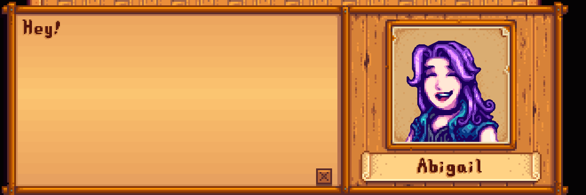
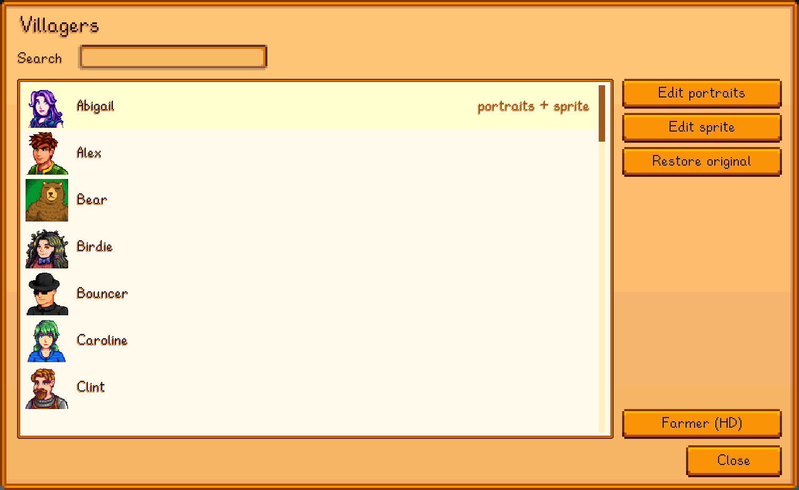
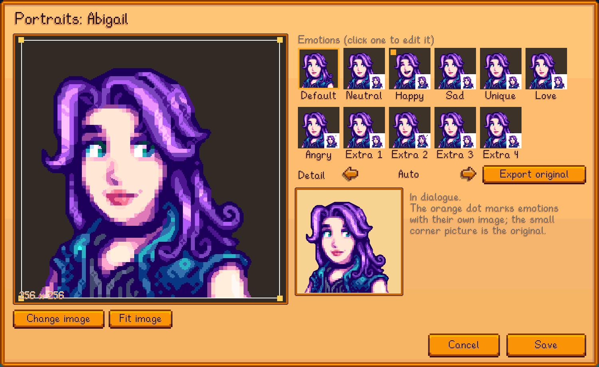
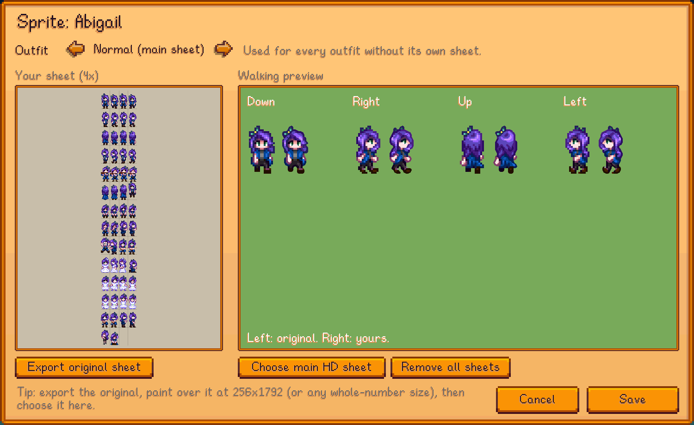
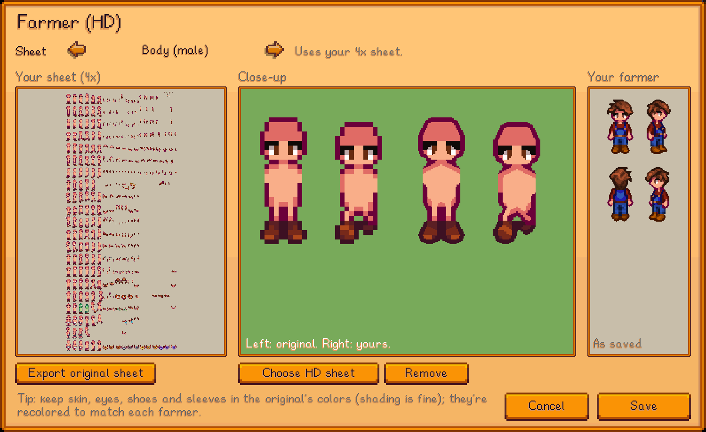

# Content Studio: Characters

A [SMAPI](https://smapi.io) mod for Stardew Valley 1.6 that replaces villager portraits and sprites (their bodies in the world) with your own images, in HD, and draws the farmer in HD.

**Requires [Content Studio: Core](../CustomContentCore)**, in this repo.

**Status:** tested by hand on Linux only (Stardew Valley 1.6.15, SMAPI 4.5.2); Windows and macOS are untested. See [test coverage](../docs/TESTING.md) and [compatibility](../docs/COMPATIBILITY.md).

## Screenshots


*Left: the game. Right: HD sprite sheets (made by upscaling the originals with Scale2x, just to demonstrate).*


*HD portrait in dialogue.*


*Villager list.*


*Portraits: one image for every emotion, with overrides.*


*Sprite sheet with walking preview.*


*Farmer HD sheets.*

All images in the screenshots are made for the demo.

## Installing

1. Install [SMAPI](https://smapi.io).
2. Put **Content Studio: Core** and this mod in the game's `Mods` folder (build them, see *Building*).
3. Start the game through SMAPI and press `K` to open the editor.

## Features

- Editor section **Characters** (press `K`): pick a villager, choose an image (from anywhere on your computer) and crop it.
- **One image for every emotion**, with optional **per-emotion overrides** (neutral, happy, sad, unique, love, angry, and extras).
  A villager is either fully replaced or left alone: every emotion without its own image uses the default image.
- **HD everywhere the game shows portraits** (dialogue, shops, events): Auto (matches your screen), Pixel art, Sharp or HD.
- Beach/seasonal portrait variants are replaced too.
- **HD sprites (bodies)**: export a villager's original sprite sheet, paint over it at any whole-number size (e.g. 4x), and import it.
  Animated walking previews compare yours with the original. Your main sheet is used for every outfit (winter, beach, ...) unless
  an outfit has its own sheet; shorter outfit sheets (like beach) use the top of the main sheet.
- **HD farmer** (*Farmer (HD)* button): HD sheets for the farmer's body (male/female, with or without hair), hairstyles,
  shirts, pants, hats and accessories. Export the game's sheet, paint over it at any whole-number size, and choose it; a
  preview shows your farmer in all four directions. For the hats and accessories sheets, a *Try on* option puts one on the
  preview farmer (your real farmer isn't changed). Any sheet you don't replace stays as it is. Applies to every farmer you see
  (you and other players), in the world and in menus.
  - The game's colors still apply: hair color and clothing dyes tint the HD sheets.
  - Body sheets are recolored per farmer (skin, eyes, shoes and sleeves), like the game does. Keep those parts in the original
    sheet's colors; shading around them is fine. Each HD pixel is matched with the colors the original sprite uses at that spot,
    so nearby details in similar colors (like a held item next to a sleeve) keep their own color.
  - The game's sheets are never changed, so the normal look is the fallback if a sheet doesn't fit (e.g. another mod resized it).
- **Export original**: save a villager's original portrait (per emotion) as a PNG to tweak in your own image editor, then import it back.

## Files

| Path | What it is |
|---|---|
| `characters.json` | The replaced portraits, sprites and farmer sheets (written by the editor; reloads automatically when edited). |
| `images/` | Images picked in the editor. |
| `config.json` | `HdPortraits` (default `true`). |

## Console commands

| Command | Description |
|---|---|
| `cchar_editor [name] [sprite]` | Open the editor, optionally straight into a villager's portraits (or sprite). `cchar_editor farmer` opens the farmer editor. |
| `cchar_export <name> [emotion\|sprite]` | Export a villager's original portrait (emotion index, default 0) or sprite sheet as a PNG. |
| `cchar_export_farmer <sheet>` | Export one of the game's farmer sheets (`farmer_base`, `farmer_girl_base`, `farmer_base_bald`, `farmer_girl_base_bald`, `hairstyles`, `hairstyles2`, `shirts`, `pants`, `hats`, `accessories`) as a PNG. |
| `cchar_reload` | Reload `characters.json` and images. |

## Building

```sh
dotnet build CustomCharacters
```
