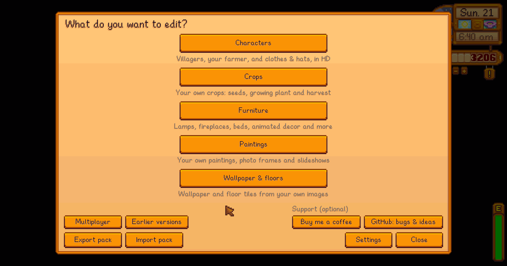
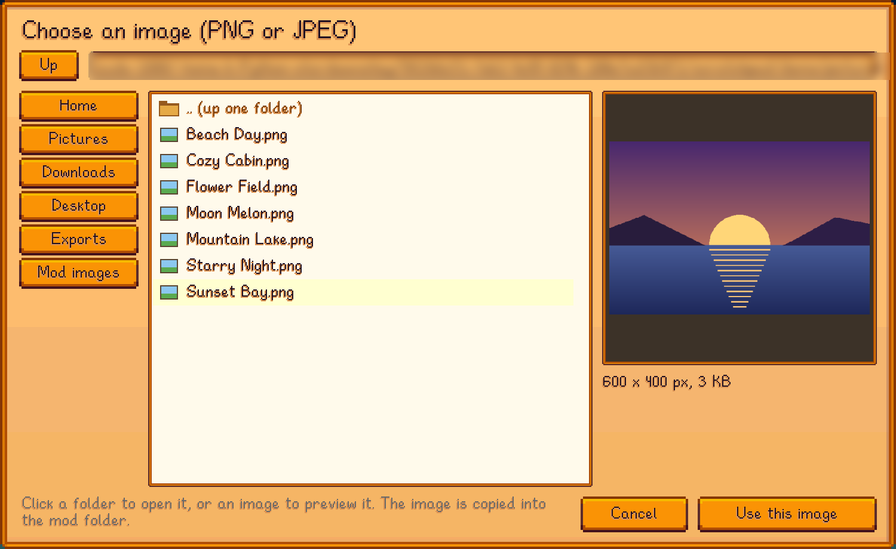

# Content Studio: Core

Shared library mod for the Custom Content family of [SMAPI](https://smapi.io) mods for Stardew Valley 1.6.

It provides:
- **The in-game editor** (press `K`): one editor where each installed Custom Content mod adds a section.
- **Editor building blocks**: screens, buttons, cyclers, checkboxes, text fields, scroll lists, confirm dialogs.
- **File browser** for any folder on the computer (with drives/volumes on Windows/macOS/Linux).
- **Image tools**: PNG/JPEG decoding, cropping, framing (built-in and 9-slice custom frames), high-quality downscaling.
- **Export originals**: save the game's original art as PNG (optionally enlarged with sharp pixels) to edit in an external program and import again.
- **Content packs**: *Export pack* saves all custom content of every Custom Content mod (data + images) into one `.zip`;
  *Import pack* loads it on another PC (replacing that content, after automatically backing up the current content to `Exports/Backups`).
  Imports only write into each mod's registered content files/folders.
- **One content set per multiplayer game** (off by default, opt-in on both sides): with *Share my content when I host*, everyone in
  the Host's game uses the Host's content - paintings, crops, furniture, wallpaper and character sheets alike - so there is one
  answer to whose hair sheet is in use and placed items keep the IDs they were placed with. A player who turns on *Accept shared
  content* has their own content saved to a backup zip first, and it comes back when they leave. Only changed files are sent
  (SHA-256 checked). Split-screen is skipped.
- **Players changing the Host's content** (off by default, *Let players change my content*): if the Host allows it, Player A can
  edit the set everyone is using. Whatever Player A opens is held until they close it, so Player B can't write over them, and the
  Host can take anything back. What Player A saves is sent to the Host, who checks it, keeps the version it replaces and passes the
  new one on to everyone. Only the Host writes the Host's files. See [Multiplayer security](#multiplayer-security).
- **Earlier versions**: every save keeps a copy of the data file it replaces (the last 10), and any of them can be put back from
  the editor's *Earlier versions* screen.
- **Full-screen image viewer** with captions and slideshow navigation.
- **High-resolution furniture drawing**: mods register a renderer and their furniture is drawn from their own (sharper) texture.

**Status:** tested by hand on Linux only (Stardew Valley 1.6.15, SMAPI 4.5.2); Windows and macOS are untested. See [test coverage](../docs/TESTING.md) and [compatibility](../docs/COMPATIBILITY.md).

## Screenshots


*The editor start page (press K).*


*The pixel editor: tools down the left, guides for what the game expects in the sheet you're editing.*


*Multiplayer: one content set per game, the host's, with a lock on whatever you have open.*


*Picking an image (the folder path is blurred).*

All images in the screenshots are made for the demo.

## Paint

Editors that work with pixel art have a **Paint** button that opens the image in the game. The tools are down the left:
pencil, brush, eraser, eyedropper, fill, line, rectangle, ellipse, replace a colour everywhere, replace it only where you drag,
and a rectangular selection you can move, copy, paste, clear, flip or turn. Shapes can be outlined or filled, Shift keeps
lines straight and boxes square, and mirror drawing repeats your strokes inside the sprite you're drawing in. There's
zoom (to the cursor), a grid for sprite and pixel boundaries, and undo/redo.

**Colour** shows the art in a colour without changing it, which is what you want for sheets the game colours itself: hair is
stored in grey so your character's hair colour can tint it, and this previews that. Pick one of the presets or any colour.

**Guides** show what the game expects in the sheet you're editing: where each sprite begins and ends, and the parts inside
it (which facing direction a band of pixels is, for example). The top right always says where the cursor is: the pixel, the
sprite number, the position within that sprite, and which part it's in. **Sprite** jumps to a sprite by the same number the
editors use and selects it. **Behind** switches what's drawn under see-through pixels: a checkerboard, or plain dark, light
or pink to judge the art against. Guides, the grid and the background can each be turned off. It edits a copy and saves as a new PNG
in the mod's images folder, so the art you started from is never overwritten.

Starting from the game's own art (a farmer sheet, a villager sprite, a piece of furniture) copies it first and asks what
size to draw at: **the game's size (1x)**, 2x, or 4x. 1x is one pixel per game pixel, which is what most pixel art wants;
the bigger sizes are for HD art. The colours below the canvas are the ones the image already uses, ordered by how much
it uses them or grouped by colour; **Choose colour** opens a picker for any other colour (drag in the shade square, pick a
hue, or type red, green, blue and see-through values), and the colours you pick that way stay in the row while you paint.

The **pencil** draws crisp pixels and the **brush** fades out at its edge, which suits bigger tips and HD sheets. Both (and
the eraser and replace-drag) use the **size** and **tip shape** chosen beside the canvas: square, round or diamond, from one
pixel up to sixteen.

Saving in the paint screen is the only save: the image is written and the item you were editing is updated straight away.

Every key here can be changed with the **Keys** button, and the choice is kept in the Core's `config.json`. The key that
opens the editor, the export size and the folders are under **Settings** on the start page. As they come -
tools: `P` pencil, `B` brush, `E` eraser, `I` pick colour, `F` fill, `L` line, `R` rectangle, `O` oval, `A` replace all,
`D` replace drag, `S` select, `H` move view. Other: `C` copy, `V` paste, `Delete` clears the selection, `Z` undo, `Y` redo,
`+`/`-` zoom, `0` fills the width, `Shift` keeps lines and boxes straight, and holding `space` drags the image.

## Support

Thanks for using these mods! They're free, and every feature works without donating. If you'd like to, you can
[buy me a coffee](https://buymeacoffee.com/donateifyoucan). The editor's start page has a small optional *Support* section
with buttons that copy this link and the [GitHub page](https://github.com/DonateIfYouCan/stardew-content-studio) to the clipboard. There are no
pop-ups or reminders.

## For mod authors

1. Add a dependency in your `manifest.json`:
   ```json
   "Dependencies": [ { "UniqueID": "DonateIfYouCan.CustomContentCore", "MinimumVersion": "0.1.0" } ]
   ```
2. Reference the Core project/DLL without copying it (`Private="False"`).
3. In your `Entry` method:
   ```cs
   CustomContent.RegisterEditor(this.ModManifest, "Paintings", "Your own paintings", () => new MyMainScreen());
   CustomContent.RegisterFurnitureRenderer(MyStore.TryGetTexture);
   CustomContent.RegisterHdTexture(gameTexture, MyHdProvider); // draw any game texture from an HD version
   ContentPacks.Register(this.ModManifest, helper.DirectoryPath, new[] { "mydata.json", "images" }, MyStore.Reload); // packs + multiplayer sharing
   ```
   Load content from `ContentPacks.GetContentRoot(manifest, helper.DirectoryPath)` (it points to the host's content in multiplayer),
   call `CustomContent.EnsureEditable(manifest)` before saving and `CustomContent.NotifyContentChanged()` after, and read JSON with
   `CustomContent.ReadJsonFile<T>()` (lists replace defaults instead of being appended to).
   Also available: `ImageExport.Export(...)`, `OriginalContent.LoadTexture/LoadData(...)` (read unmodded game files), and the UI widgets (`CropWidget`, `FileBrowserScreen`, `ViewerMenu`, ...).

## Console commands

| Command | Description |
|---|---|
| `ccc_editor` | Open the editor start page. |
| `ccc_export` | Export all custom content into a pack (`.zip`) in the export folder. |
| `ccc_import <file>` | Import a pack (current content is backed up first). |

## Config

`config.json`:
- `EditorKey` (default `K`)
- `BrowserStartFolder` (default: your Pictures folder)
- `ExportFolder` (default: `Pictures/Stardew Custom Content`; also a shortcut in the file browser)
- `ExportScale` (default `4`: exports are enlarged 4x with sharp pixels; `1` = original size)
- `ShareContentAsHost` (default `false`) and `AcceptContentFromHost` (default `false`): multiplayer content sharing (also toggles on the editor's start page)

## Multiplayer security

The other side may run a modified mod or game and send anything, so each player's own checks are what protect them.

**Who is allowed to send.** SMAPI's sender ID can be forged: the host forwards farmhands' messages, and a modified SMAPI can
claim to be the host. So a player who accepts content makes a random 256-bit secret for each player who shares, and sends it
only to them. Messages addressed to one player are never forwarded to the others, so nobody else sees the secret. Offers and
file data without the right secret are ignored, and a player only ever gets one secret per game.

**What is accepted before download:**
- only registered mods and their content paths;
- only `.json`, `.png`, `.jpg` or `.jpeg` files; never a zip, DLL, manifest or config;
- plain relative paths: letters, digits, space, `_ - . ( )`; no `..`, absolute paths, backslashes or device names like `CON`;
- at most 64 MB per file, 2 MB per JSON file, 2000 files and 200 MB per host;
- chunk counts, sizes and SHA-256 hashes are checked.

**Every received file is rebuilt from scratch before it's stored**, so only real content survives:
- Images must be PNG data; the host converts JPEGs before sending. They're decoded by Core's own managed PNG decoder, never
  the game's native one, with checksums verified, at most 8192 px per side, and exact-size decompression. Then
  they're re-encoded as a plain RGBA PNG. Metadata, appended data such as a hidden zip, and malformed structures are dropped.
- JSON must be a UTF-8 object, at most 32 levels deep, with text values under 20,000 characters. It's parsed and written out
  again without comments or `$...` properties like `$type`. The mods never enable Newtonsoft type handling.

**Changes from players.** The Host only accepts them with *Let players change my content* on, only from a player who holds that
file (or for a file the Host doesn't have yet), and only for the Host's own registered content paths. What arrives is rebuilt from
scratch like anything else received, and the version it replaces is kept in a `versions` folder. Locks are a courtesy between
players, not a safeguard: the Host checks again before writing, and can take a file back from anyone.

**Where it goes.** Files are written only to `host-content/<player>/`, and only the 5 most recent players are kept. Images are
loaded only from inside the content folder, so a data file can't point to other files on the PC. Nothing received is ever
executed or extracted.

**When you share.** You share only files in use: the data file and the images it references, never unused or deleted images,
links, config, manifests or DLLs. It ignores requests without the player's secret, requests for files it didn't offer, and
repeated requests while a send is still in progress.

## Building

```sh
dotnet build CustomContentCore
```
Deploys to the game's `Mods/CustomContentCore` folder.
