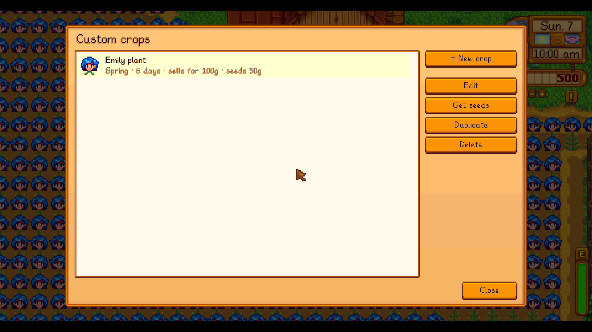

# Content Studio: Crops

A [SMAPI](https://smapi.io) mod for Stardew Valley 1.6 that adds your own crops (seeds, growing plant and harvest) with an in-game editor, in HD.

**Requires [Content Studio: Core](../CustomContentCore)**, in this repo.

**Status:** tested by hand on Linux only (Stardew Valley 1.6.15, SMAPI 4.5.2); Windows and macOS are untested. See [test coverage](../docs/TESTING.md) and [compatibility](../docs/COMPATIBILITY.md).

## Screenshots


*Crop editor with seeds, harvest and a preview of every growth stage.*


*Paint the growing plant frame by frame, from seedling to ripe.*


*The crop in the world.*


*Your crops.*

All images in the screenshots are made for the demo.

## Installing

1. Install [SMAPI](https://smapi.io).
2. Put **Content Studio: Core** and this mod in the game's `Mods` folder (build them, see *Building*).
3. Start the game through SMAPI and press `K` to open the editor.

## Features

- Editor section **Crops** (press `K`): make a crop in a few clicks.
  - **Harvest icon** from any image (with crop tool); **seed packet** made automatically from it (the game's packet, or one you paint, with the harvest icon on its front), or your own image. **Paint** works on each of them.
  - **Growing plant**: looks like any game crop (frames are rearranged to fit your number of growth stages), or your own
    growth sheet (8 frames of 16x32, or a whole-number multiple for HD). **Export template** saves a game crop's sheet to paint over.
  - Seasons, days per growth stage, regrowing, trellis, scythe, harvest amount.
  - Harvest type (vegetable/fruit/flower), sell price, energy if edible, seed price.
  - Seeds sold at Pierre's and/or JojaMart (in season), and/or the traveling cart, at exactly your price.
  - Live preview of the seed packet, harvest icon and every growth stage.
  - **Gifts:** which villagers love, like, dislike or hate the harvest.
  - **Colour:** worked out from the harvest image, or chosen. The game uses it for dyeing, flower honey, and the colour of the wine, jelly, juice or pickles made from it.
- **The game's crops** (second tab): new art, take the seeds out of the shops, or **make your own copy** to change, starting from its art, growth, prices, shops, colour and gift tastes.
- Crops behave like the game's own: watering, growing, harvesting, shipping, collections, quality.
- **HD** icons and plants (Auto, Pixel art, Sharp, HD).

## Files

| Path | What it is |
|---|---|
| `crops.json` | Your crops (written by the editor; reloads automatically when edited). |
| `images/` | Images picked in the editor. |

## Console commands

| Command | Description |
|---|---|
| `ccrop_editor [name]` | Open the editor, optionally straight into a crop. |
| `ccrop_list` | List your crops. |
| `ccrop_give <name> [count]` | Put seeds (and one harvest) in your inventory. |
| `ccrop_export <game crop>` | Export a game crop's growth sheet (like `Parsnip`) as a template. |
| `ccrop_reload` | Reload `crops.json` and images. |

## Notes

- Don't delete a crop you've planted: planted crops, seeds and harvests of it become Error Items.
- In multiplayer, every player needs the mod and the same images.

## Building

```sh
dotnet build CustomCrops
```
