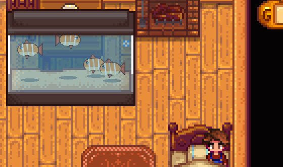

# Content Studio: Fish

A [SMAPI](https://smapi.io) mod for Stardew Valley 1.6 that adds your own fish with an in-game editor: where and when they
bite, the fishing minigame, crab pots, fish tanks, fish ponds and gifts. It can also give the game's own fish new art, or
stop them biting.

**Requires [Content Studio: Core](../CustomContentCore)**, in this repo.

**Status:** tested by hand on Linux only (Stardew Valley 1.6.15, SMAPI 4.5.2); Windows and macOS are untested. See [test coverage](../docs/TESTING.md) and [compatibility](../docs/COMPATIBILITY.md).

## Screenshots


*The fish editor: seasons, weather, time of day and the places it bites.*


*Fish in a tank. The demo fish, and the game's carp given the same art.*

All images in the screenshots are made for the demo.

## Installing

1. Install [SMAPI](https://smapi.io).
2. Put **Content Studio: Core** and this mod in the game's `Mods` folder (build them, see *Building*).
3. Start the game through SMAPI and press `K` to open the editor.

## Features

- Editor section **Fish** (press `K`), with a page for each part:
  - **Fish:** picture (any image, cropped to a square, or painted in the game), name, description, price, energy if eaten, detail (pixel art to HD).
  - **Catching:** a fishing rod or a crab pot. For a rod: difficulty, how it moves in the minigame (mixed, dart, smooth,
    sinker, floater), size range, how often it bites and the fishing level needed. For a crab pot: fresh water or ocean.
  - **Where:** seasons, weather, the hours it bites, and the places: the town river, mountain lake, forest river and pond,
    the ocean, Secret Woods, desert, sewers, witch's swamp, Mutant Bug Lair, mines, night market submarine, Ginger Island
    and the volcano. Farms with water borrow from the forest, town, mountain or ocean, so it bites there too.
  - **Tank & pond:** whether it can live in a fish tank and how it swims there (the picture can be turned and mirrored so it
    swims level and head first), and whether it can live in a fish pond, with the colour of its roe.
  - **Gifts:** click a villager to set whether they love, like, dislike or hate it.
- **The game's fish** (second tab): give one new art, used for the item and in tanks, or stop it biting anywhere (crab pot
  fish too). Fish already caught stay. Stopping a fish that a bundle or quest needs means that can't be finished.
- **Custom fish in the mines** only bite on floors 20 and 60: floor 100 has its own list the game never looks past.
- Fish are real fish to the game: they count as "any fish" in cooking recipes, go in the fishing collection, and sell and
  ship like the game's.

## Files

| Path | What it is |
|---|---|
| `fish.json` | Your fish and changes to the game's fish (written by the editor; reloads automatically when edited). |
| `images/` | Images picked or painted in the editor. |

## Console commands

| Command | Description |
|---|---|
| `cfish_editor [name]` | Open the editor, optionally straight into a fish. |
| `cfish_list` | List your fish. |
| `cfish_give <name> [count]` | Put a fish in your inventory. |
| `cfish_reload` | Reload `fish.json` and images. |

## Notes

- Don't delete a fish you've caught: caught ones, and any in tanks or ponds, become Error Items.
- A fish added to your game counts toward catching every fish.
- In multiplayer, every player needs the mod. With the Core's content sharing on, everyone uses the Host's fish.

## Building

```sh
dotnet build CustomFish
```
