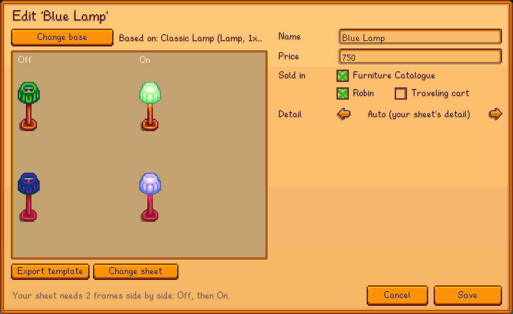
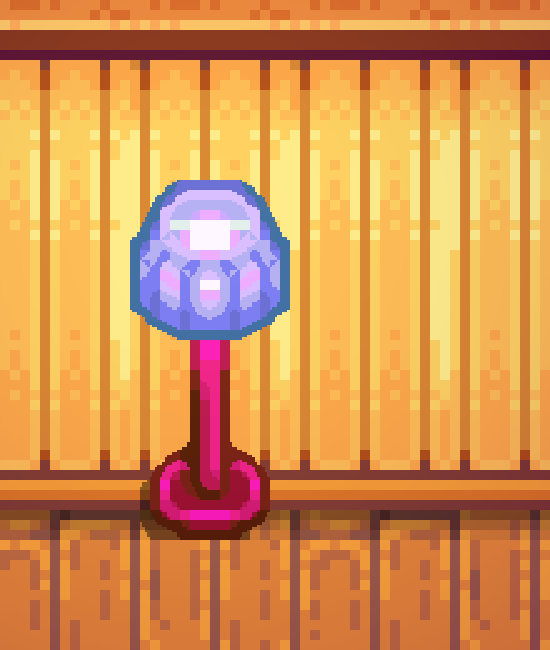
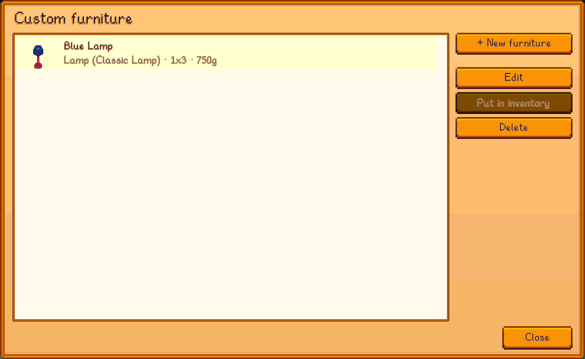

# Custom Furniture

A [SMAPI](https://smapi.io) mod for Stardew Valley 1.6 to make your own furniture from your images, in HD: lamps that turn on at night,
fireplaces with fire, beds you can sleep in, animated decor, tables, rugs and more.

**Requires [Custom Content Core](../CustomContentCore)**, in this repo.

**Status:** tested by hand on Linux only (Stardew Valley 1.6.15, SMAPI 4.5.2); Windows and macOS are untested. See [test coverage](../docs/TESTING.md) and [compatibility](../docs/COMPATIBILITY.md).

## Screenshots


*Furniture based on a game lamp, with off and on frames.*


*The lamp switched on at night.*


*Your furniture.*

All images in the screenshots are made for the demo.

## Installing

1. Install [SMAPI](https://smapi.io).
2. Put **Custom Content Core** and this mod in the game's `Mods` folder (build them, see *Building*).
3. Start the game through SMAPI and press `K` to open the editor.

## How it works

Every piece is **based on a game furniture item**: it copies that item's type, size, collision and behavior, and uses your art.

| Based on | Frames in your sheet (side by side) | Behavior |
|---|---|---|
| Lamp, sconce, torch, window | 2: off, on | Turns on by itself at night and gives light |
| Bed (single, double, child) | 2: bed, blanket (drawn over you) | Sleep in it |
| Fireplace | 1 | Click to light; the game draws the fire |
| Decor, table, rug, bookcase, ... | 1, or several for an **animation** | Tables hold items; animations loop at your speed |

1. In the editor (press `K`, then **Furniture**), click **New furniture** and pick the base from a searchable list with pictures.
2. **Export template** saves the base's sprite (all frames, enlarged) to paint over in your image editor.
3. **Choose your sheet**: any whole-number multiple of the template's size (like 4x for HD). The editor checks the layout.
4. Set name, price, and where it's sold (Furniture Catalogue, Robin, traveling cart). Previews show each frame next to the original.

## Console commands

| Command | Description |
|---|---|
| `cfurn_editor [name]` | Open the editor, optionally straight into a piece. |
| `cfurn_list` | List your furniture. |
| `cfurn_templates [search]` | List the game furniture you can base yours on. |
| `cfurn_export <furniture ID>` | Export a game furniture sprite as a template. |
| `cfurn_give <name>` | Put a piece in your inventory. |
| `cfurn_reload` | Reload `furniture.json` and images. |

## Notes

- Deleting a piece you've placed turns placed copies into Error Items.
- In multiplayer, every player needs the mod and the same images.

## Building

```sh
dotnet build CustomFurniture
```
