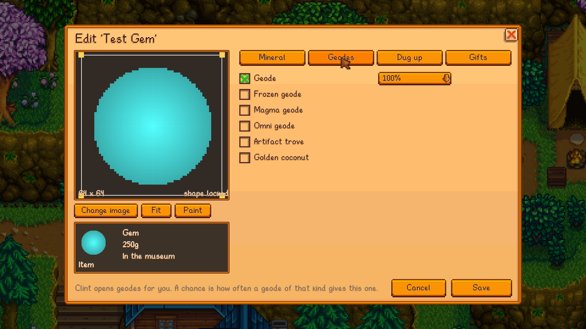
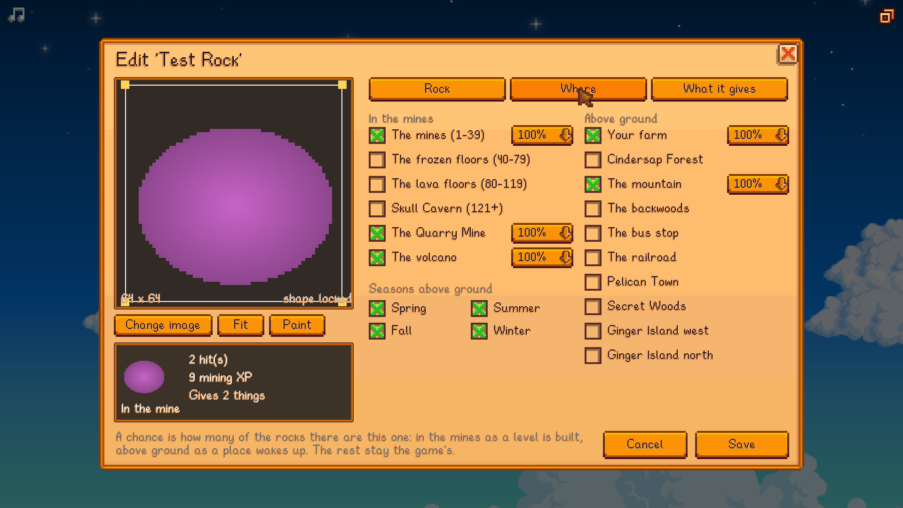
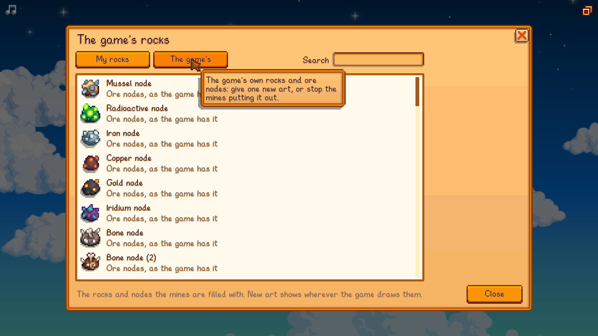

# Content Studio: Mining & Museum

A [SMAPI](https://smapi.io) mod for Stardew Valley 1.6 that adds your own minerals, gems and artefacts with an in-game
editor: which geodes give them, where they're dug out of artefact spots, whether the museum takes them, and how villagers
feel about them as a gift. It can also give the game's own new art, or stop one being found.

**Requires [Content Studio: Core](../CustomContentCore)**, in this repo.

**Status:** tested by hand on Linux only (Stardew Valley 1.6.15, SMAPI 4.5.2); Windows and macOS are untested. See [test coverage](../docs/TESTING.md) and [compatibility](../docs/COMPATIBILITY.md).

## Installing

1. Install [SMAPI](https://smapi.io).
2. Put **Content Studio: Core** and this mod in the game's `Mods` folder (build them, see *Building*).
3. Start the game through SMAPI and press `K` to open the editor.

## Features

- Editor section **Minerals** (press `K`), with a page for each part:
  - **Mineral:** picture (any image, cropped to a square, or painted in the game), name, description, what it is
    (mineral, gem or artefact), price, detail (pixel art to HD), colour, and whether the museum takes it.
  - **Geodes:** which of the six geodes can give it — geode, frozen geode, magma geode, omni geode, artifact trove and
    golden coconut — and how often each one does.
  - **Dug up:** where artefact spots can turn it up, and how often, across the valley, the mines, the desert and Ginger
    Island. Only artefacts are dug up, as in the game.
  - **Gifts:** click a villager to set whether they love, like, dislike or hate it.
- **The game's own** (second tab): give one new art, used for the item and in the museum, or stop it being found in any
  geode or artefact spot. Ones you already have stay. Stopping something a bundle, quest or the museum needs means that
  can't be finished.
- **Make my own copy** starts one of yours from the game's: its picture, kind, price, colour, geodes, dig spots and gift
  tastes, all yours to change. The game's stays as it is.
- Editor section **Rocks** (press `K`): rocks of your own that turn up in place of the game's, with a picture, how many
  hits they take, the mining experience they give, where they appear and how often - the mines' three stretches, Skull
  Cavern, the Quarry Mine, the volcano on Ginger Island, and above ground on the farm, the forest, the mountain and quarry, the backwoods, the bus stop, the railroad, town, Secret
  Woods and Ginger Island, in the seasons you pick - and what they give when broken (any of your minerals, the game's minerals, gems and artefacts, or ores and
  other bits). What they give is on top of what any rock gives.
- **The game's rocks** (second tab of Rocks): every rock and ore node the mines are filled with, from copper and iridium
  nodes to gem, geode and bone nodes and the plain grey rocks. Give one new art, stop the mines putting it out (a plain
  rock of that depth stands in, so a floor always has something to break), or make your own copy from its picture.
- What you add is real to the game: minerals and artefacts can be donated to the museum and count towards its rewards,
  gems count as gems (so the gemologist profession pays out), and everything sells and ships like the game's own.

## Screenshots


*A mineral: which geodes give it and how often, typed as a percentage.*


*A rock: the caves and the places above ground it turns up in, and the seasons.*


*Every rock the mines are filled with, to reskin or hold back.*

All images in the screenshots are made for the demo.

## Files

| Path | What it is |
|---|---|
| `minerals.json` | Your minerals, your rocks and changes to the game's minerals and rocks (written by the editor; reloads automatically when edited). |
| `images/` | Images picked or painted in the editor. |

## Console commands

| Command | Description |
|---|---|
| `cmine_editor [name]` | Open the editor, optionally straight into one. |
| `cmine_list` | List your minerals, gems and artefacts. |
| `cmine_give <name> [count]` | Put one in your inventory. |
| `cmine_rocks` | List your rocks. |
| `cmine_rock <name>` | Put one of your rocks on the ground next to you. |
| `cmine_reload` | Reload `minerals.json` and images. |

## Notes

- Don't delete something you've found: ones in your world, in chests or donated to the museum become Error Items.
- **The museum has 102 spots** and the game's own 96 donatable items nearly fill it, so there's room for about six of
  yours before it's full. The editor says how many spots are left on the Mineral page. Once it's full the game won't let
  you put anything down - and because its donation screen refuses to close while you're holding something, that would
  leave you stuck; this mod lets you back out in that one case, and the item returns to your inventory.
- The museum takes minerals, gems and artefacts alike (as it does the game's own diamonds and rubies); turning off
  "Can be donated to the museum" is what keeps one out.
- Above ground, a rock of yours takes the place of one the game spawned overnight, so it follows the game's own rules
  about where rocks can appear (nothing on the beach, in the desert, or anywhere in winter). That covers every way the
  game has of putting a rock out: the daily weeds-and-stones spawn, the mountain quarry, the quarry on the Hill-top and
  Four Corners farms (and any farm map that spawns mountain ore), and Ginger Island's mussel nodes.
- Nothing is swapped on the day you load a save: the morning's rocks are worked out by comparing a place against how it
  was left the night before.
- Stopping one of the game's rocks turning up covers the caves (the mines, Skull Cavern, the Quarry Mine and the
  volcano), where a plain rock of that cave stands in. It doesn't reach rocks spawned above ground.
- The game calls every rock "Stone", so a rock's name is only ever seen in the editor.
- In multiplayer, custom minerals can be handed to another player like any item: gifted face to face, dropped, or left in
  a chest. The game doesn't allow furniture (so paintings and wallpaper) to be gifted face to face.
- In multiplayer, every player needs the mod. With the Core's content sharing on, everyone uses the Host's set.

## Building

```sh
dotnet build CustomMining
```
