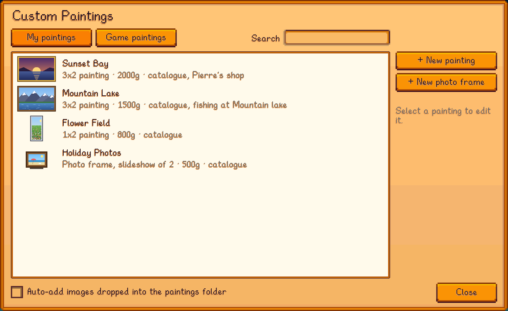
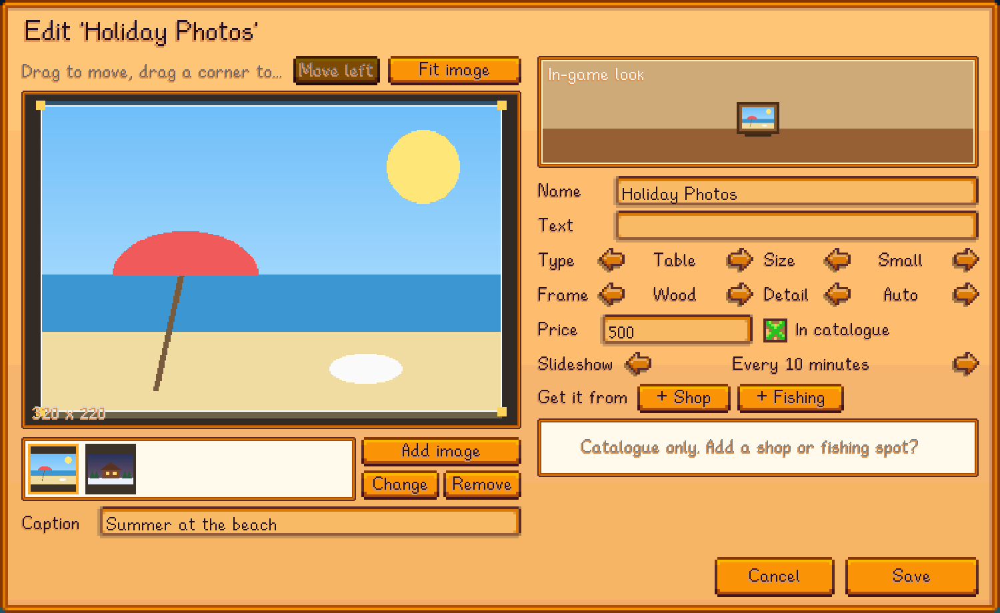
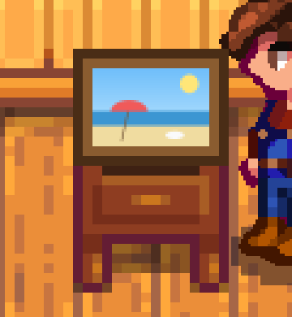
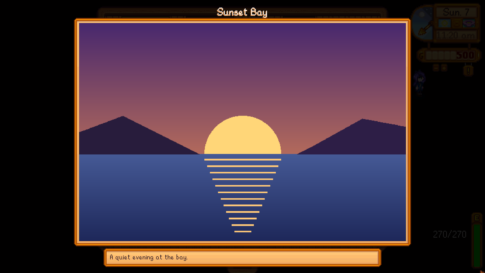
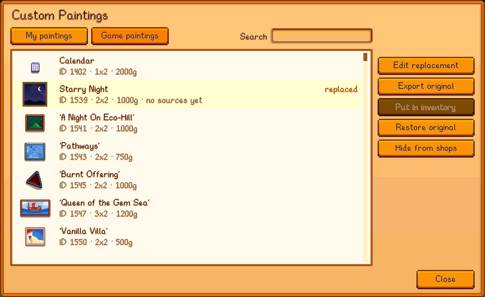

# Custom Paintings

A [SMAPI](https://smapi.io) mod for Stardew Valley 1.6 that turns your own PNG/JPEG images into paintings, photo frames and slideshows, with an in-game editor.

**Requires [Custom Content Core](../CustomContentCore)** (shared editor, image tools and HD drawing), in this repo.

**Status:** tested by hand on Linux only (Stardew Valley 1.6.15, SMAPI 4.5.2); Windows and macOS are untested. See [test coverage](../docs/TESTING.md) and [compatibility](../docs/COMPATIBILITY.md).

## Screenshots


*Custom paintings in a shed (one of them replaces a game painting).*


*Your paintings.*


*Editing a painting: crop, frame, size, price, where to get it.*


*A photo frame with a slideshow of two images.*


*The photo frame on a table.*


*Full-screen view with the painting’s text.*


*The game’s paintings: replace, restore or hide them.*

All images in the screenshots are made for the demo.

## Installing

1. Install [SMAPI](https://smapi.io).
2. Put **Custom Content Core** and this mod in the game's `Mods` folder (build them, see *Building*).
3. Start the game through SMAPI and press `K` to open the editor.

## Features

- **In-game editor** (press `K`, also works on the title screen)
  - Pick images from anywhere on your computer; they're copied into the mod folder.
  - Drag to crop, pick a size (1x1 up to 6x3 tiles) and a frame style, and see a live in-game preview.
  - Set name, guiding text, price, and where to get it: shops (with price override) or fishing spots (chance, once only).
  - Replace the image, name or price of any painting in the game, or hide it from shops, the catalogue and fishing.
  - **Export original**: save a game painting's original art as a PNG to tweak in your own image editor, then use it as the replacement.
- **Full-screen view**: interact with a placed painting to see the original image at full resolution, with its guiding text.
- **Photo frames**: small standing frames for tables and floors (landscape or portrait).
- **Slideshows**: give a painting several images; it switches daily or every N in-game minutes, and you can flip through them in the full-screen view.
- **Frames**: none, wood, dark wood, gold, silver, white, black, or your own (see below).
- **Quick mode**: drop images into `Mods/CustomPaintings/paintings/` and they're added automatically.
- Works on Windows, Linux and macOS (pure SMAPI mod, no platform-specific code).

## Files

| Path | What it is |
|---|---|
| `paintings.json` | All paintings, replacements and removals. The editor writes this; you can also edit it by hand (it reloads automatically). |
| `paintings/` | Images added automatically (if enabled). |
| `paintings/imported/` | Images picked in the editor. |
| `frames/` | Custom frames: a PNG whose width and height are divisible by 3 (a 9-slice: corners, edges, center ignored). E.g. a 9x9 image gives a 3px frame. |
| `config.json` | `EditorCanGive` (show the "Put in inventory" button). The editor key and file browser start folder are set in Custom Content Core's `config.json`. |

## Console commands

| Command | Description |
|---|---|
| `cpaint_editor [name]` | Open the editor, optionally straight into a painting. |
| `cpaint_list` | List this mod's paintings, replacements and removals. |
| `cpaint_where [name\|all]` | Show where paintings can be obtained, from the final game data. |
| `cpaint_give <name\|all>` | Put paintings in your inventory. |
| `cpaint_vanilla [search]` | List the game's paintings with their IDs. |
| `cpaint_export <name\|ID>` | Export a game painting's original art as a PNG. |
| `cpaint_reload` | Reload `paintings.json` and images. |

## Notes

- Paintings use the game's pixel scale (16px per tile), so the in-world sprite is small; the full-screen view shows the original image.
- In multiplayer, every player needs the mod and the same images.
- Removing the mod (or deleting a painting) turns placed copies into Error Items.

## Building

Requires the .NET SDK (6.0+), SMAPI installed in the game folder.

```sh
dotnet build CustomPaintings
```

The build auto-detects the game folder and deploys the mod to `Mods/CustomPaintings`.
