# Stardew Content Studio

[SMAPI](https://smapi.io) mods for Stardew Valley 1.6 that add your own content from your own images, made and edited in an
in-game editor (press `K`), in HD where you want it.

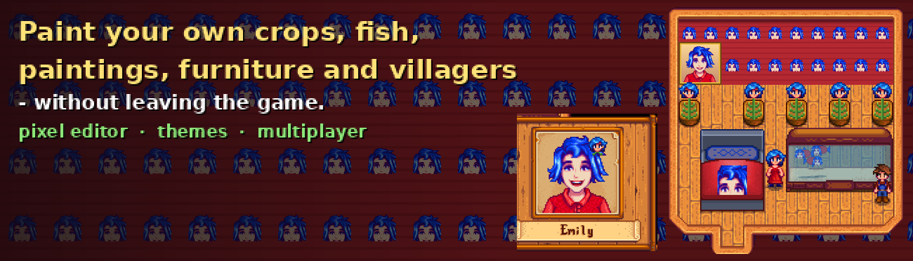

| Mod | What it does |
|---|---|
| [Content Studio: Core](CustomContentCore) | The in-game editor, file browser, image tools, a pixel editor to draw on your art in the game, HD drawing, themes (whole sets of content to switch between), backups and content packs, optional multiplayer sharing. **Required by the others.** |
| [Content Studio: Paintings](CustomPaintings) | Add, replace or hide paintings; photo frames and slideshows; full-screen viewer; sell them in shops or catch them fishing. |
| [Content Studio: Characters](CustomCharacters) | Villager portraits (per emotion) and sprites, and the farmer's body, hair and clothes, in HD. |
| [Content Studio: Crops](CustomCrops) | Your own crops: seeds, growth stages and harvest. |
| [Content Studio: Furniture](CustomFurniture) | Furniture based on a game piece: lamps that turn on, fireplaces, beds, animated decor and more. Also wallpaper and floors from your images. |
| [Content Studio: Fish](CustomFish) | Your own fish: where and when they bite, rod or crab pot, fish tanks, ponds and gifts. New art for the game's fish, or stop one biting. |
| [Content Studio: Mining & Museum](CustomMining) | Your own minerals, gems and artefacts: which geodes give them, where they're dug up, the museum and gifts. New art for the game's, or stop one being found. |

Each mod's folder has its own README with details and screenshots.

**Status:** tested by hand on Linux only (Stardew Valley 1.6.15, SMAPI 4.5.2). Windows and macOS are untested. `dotnet test`
runs 243 checks that don't need the game. See [test coverage](docs/TESTING.md) and [compatibility](docs/COMPATIBILITY.md) for
exactly what was and wasn't tested.

## Screenshots

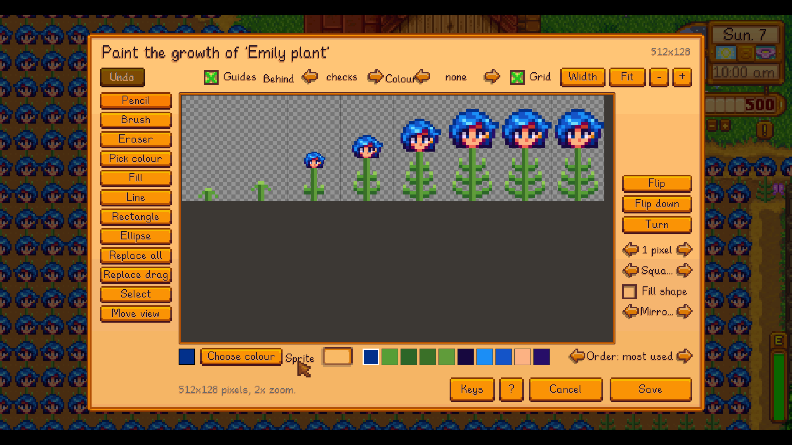
*The pixel editor, here on a crop's growth sheet: every frame from seedling to ripe, with guides for what the game expects.*

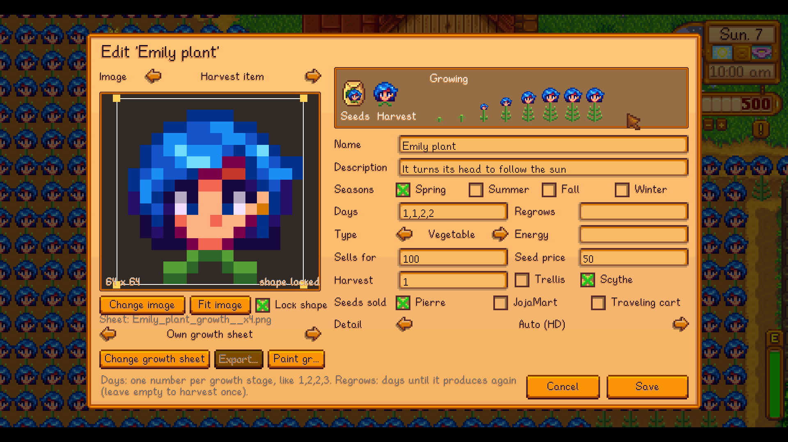
*A crop: seeds, harvest, seasons and price, with every growth stage previewed.*

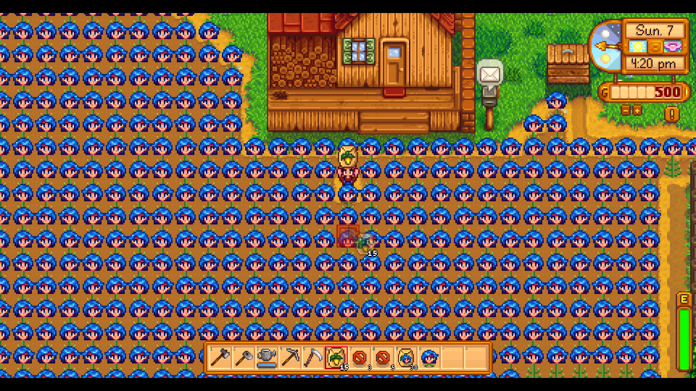
*The same crop in the world. (The demo crop is the game's own Emily sprite as the flower of a leafy plant.)*

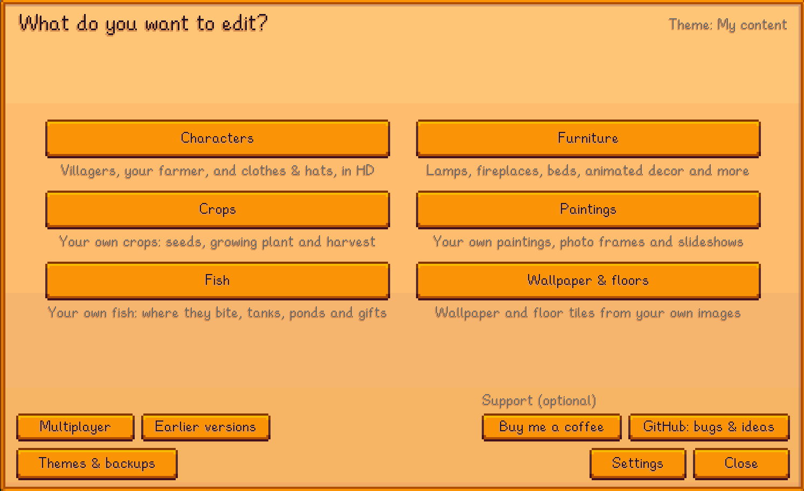
*The editor's start page (press `K`).*

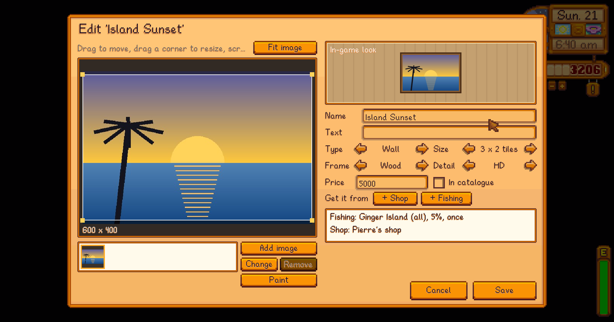
*Painting editor: crop, frame, size, price and where to get it.*

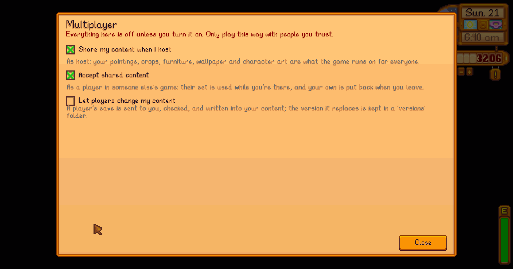
*Multiplayer: one content set per game, the host's, with a lock on whatever you have open.*

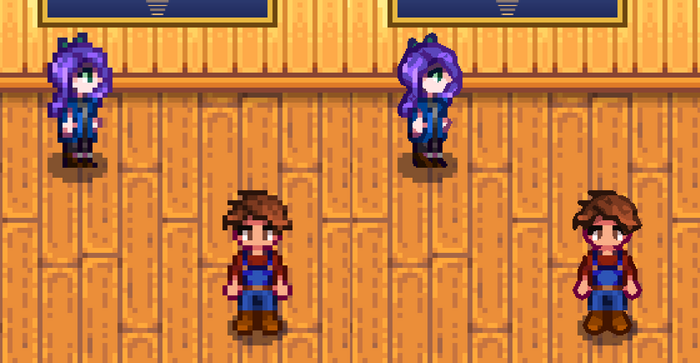
*Left: the game. Right: HD sprite sheets (the game's own sprites upscaled with Scale2x, just to demonstrate).*

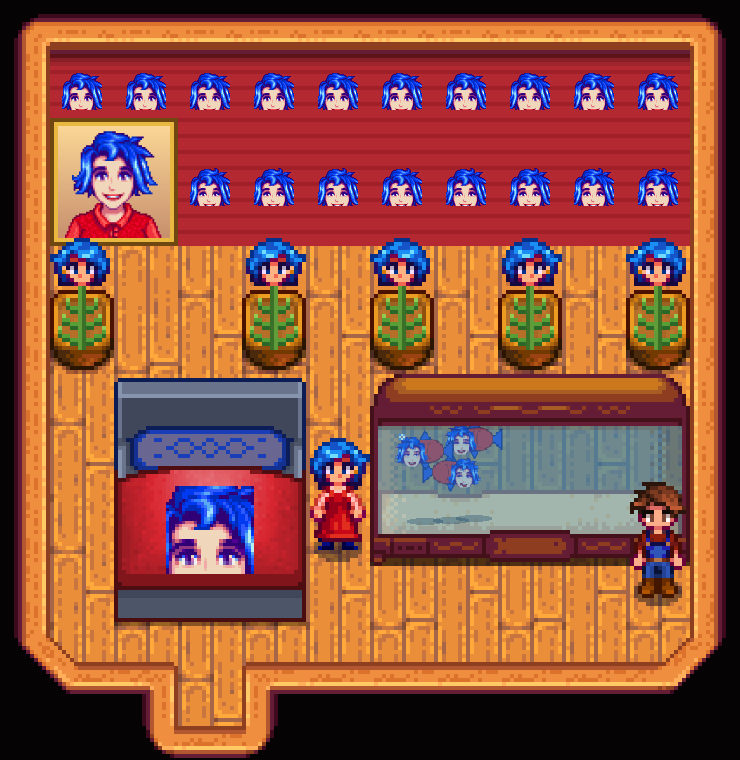
*One Emily per mod: the wallpaper, the painting, the bed, Emily fish in the tank, Emily plants in pots, and Emily with her own flower.*

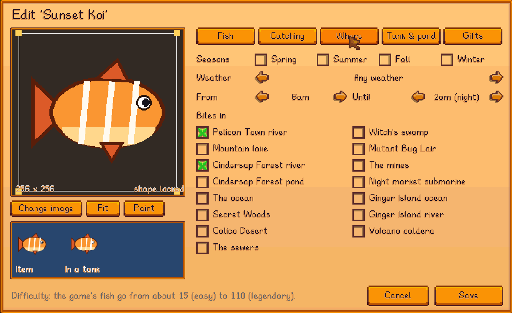
*A fish: where and when it bites. Other pages set the minigame, crab pots, fish tanks, ponds and gifts.*

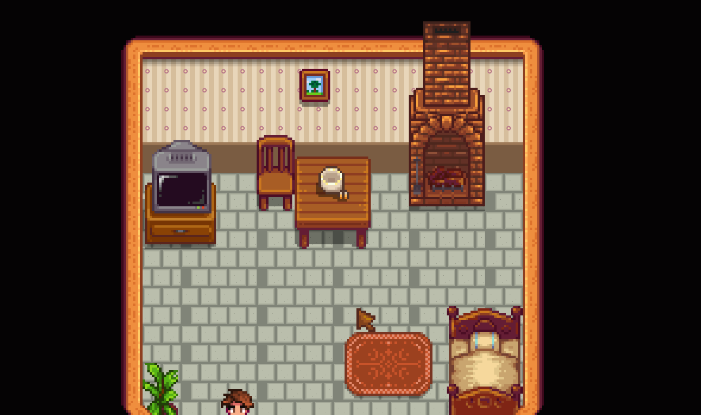
*Wallpaper and floor tiles made from your own images.*

All images in the screenshots were made for the demo.

## Installing

1. Install [SMAPI](https://smapi.io).
2. Build the mods (below). They're copied into the game's `Mods` folder automatically. Install Content Studio: Core plus the
   mods you want.
3. Start the game through SMAPI and press `K`.

In multiplayer, other players need the same mods; see the Core README for the optional content sharing and its safety checks.

## Building

Requires the .NET SDK (6.0 or newer) and SMAPI installed in the game folder.

```sh
dotnet build StardewContentStudio.sln
```

Don't build while the game is running: replacing a loaded mod DLL can crash the game.

## Feedback and bugs

Bug reports, feedback and feature requests are welcome in
[GitHub issues](https://github.com/DonateIfYouCan/stardew-content-studio/issues). For a bug, the SMAPI log
(upload it to [smapi.io/log](https://smapi.io/log)) usually says what went wrong. The editor's start page has a GitHub
button that copies the link for you.

## Support

Thanks for using these mods! They're free, and every feature works without donating. If you'd like to, you can
[buy me a coffee](https://buymeacoffee.com/donateifyoucan).

## License

[MIT](LICENSE), for everything in this repo that was made for it: the code, the docs, and the example image in
`CustomPaintings/paintings` (drawn for the demo, not a photo).

Two things the license can't cover:

- Stardew Valley, its code and its art belong to ConcernedApe. The screenshots in `docs/screenshots` show the game, and
  `characters-hd-comparison.png` shows the game's own sprites enlarged; they're here to show what the mods do. No game
  files or game code are copied into this repo or into a release.
- The mods are built against SMAPI, Harmony, Newtonsoft.Json (all MIT) and MonoGame (Ms-PL), with
  [ModBuildConfig](https://github.com/Pathoschild/SMAPI/tree/develop/src/SMAPI.ModBuildConfig) (MIT). None of them ship
  with the mods; SMAPI provides them at runtime.

This code shares nothing with Platonymous' older [Custom Furniture](https://www.nexusmods.com/stardewvalley/mods/1254)
(GPL-3.0) beyond the game APIs both have to call; the mods were renamed to avoid the confusion.
