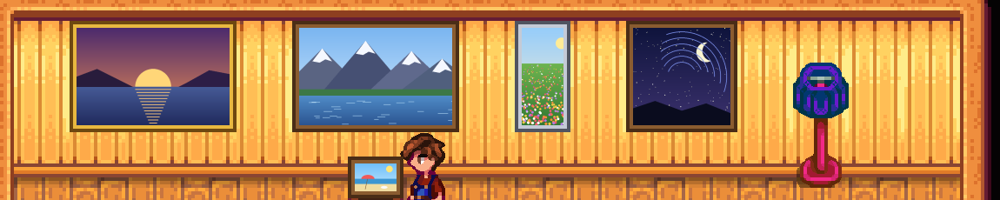
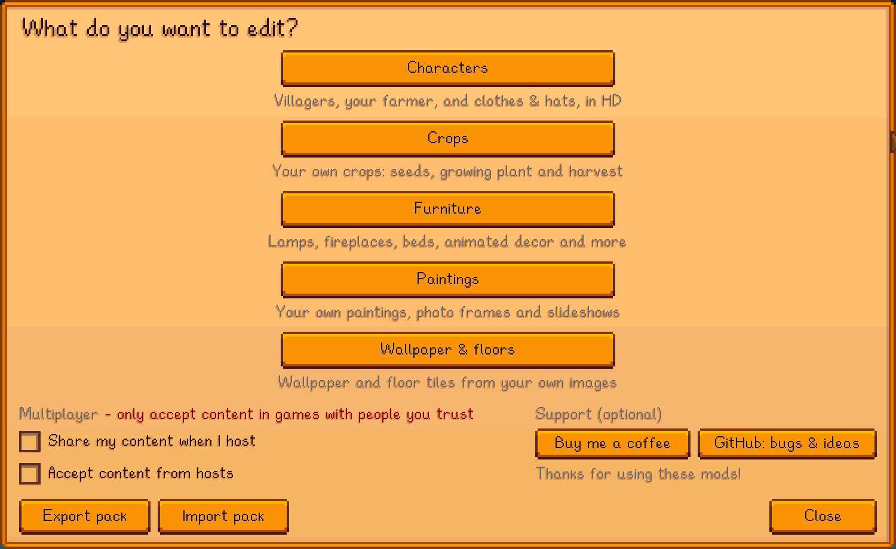
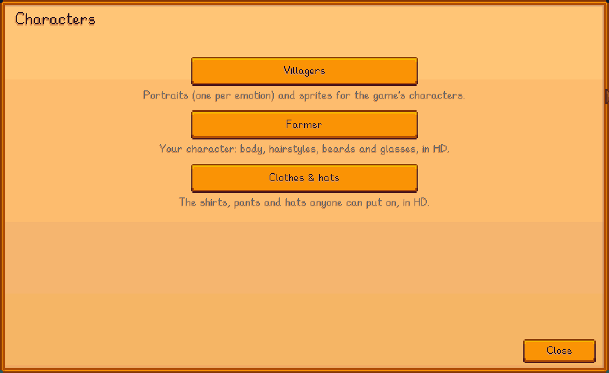
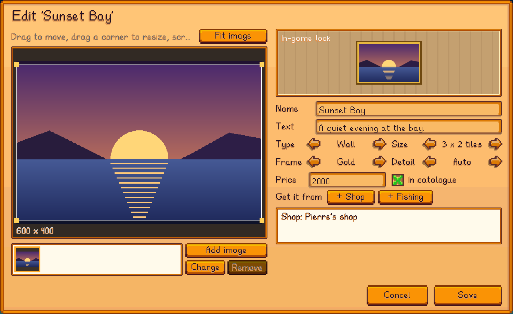

# Stardew Content Studio

[SMAPI](https://smapi.io) mods for Stardew Valley 1.6 that add your own content from your own images, made and edited in an
in-game editor (press `K`), in HD where you want it.



| Mod | What it does |
|---|---|
| [Content Studio: Core](CustomContentCore) | The in-game editor, file browser, image tools, HD drawing, export/import of content packs, optional multiplayer sharing. **Required by the others.** |
| [Content Studio: Paintings](CustomPaintings) | Add, replace or hide paintings; photo frames and slideshows; full-screen viewer; sell them in shops or catch them fishing. |
| [Content Studio: Characters](CustomCharacters) | Villager portraits (per emotion) and sprites, and the farmer's body, hair and clothes, in HD. |
| [Content Studio: Crops](CustomCrops) | Your own crops: seeds, growth stages and harvest. |
| [Content Studio: Furniture](CustomFurniture) | Furniture based on a game piece: lamps that turn on, fireplaces, beds, animated decor and more. Also wallpaper and floors from your images. |

Each mod's folder has its own README with details and screenshots.

**Status:** tested by hand on Linux only (Stardew Valley 1.6.15, SMAPI 4.5.2). Windows and macOS are untested. There are no
automated tests. See [test coverage](docs/TESTING.md) and [compatibility](docs/COMPATIBILITY.md) for exactly what was and
wasn't tested.

## Screenshots


*The editor's start page.*


*Characters: villagers, your farmer, or the clothes and hats anyone can wear.*


*Left: the game. Right: HD sprite sheets (the game's own sprites upscaled with Scale2x, just to demonstrate).*


*Painting editor.*

All images in the screenshots were made for the demo.

## Installing

1. Install [SMAPI](https://smapi.io).
2. Build the mods (below). They're copied into the game's `Mods` folder automatically. Install Content Studio: Core plus the
   mods you want.
3. Start the game through SMAPI and press `K`.

In multiplayer, other players need the same mods; see the Core README for the optional content sharing and its safety checks.

## Building

Requires the .NET SDK (6.0 or newer) and SMAPI installed in the game folder.

```sh
dotnet build StardewContentStudio.sln
```

Don't build while the game is running: replacing a loaded mod DLL can crash the game.

## Feedback and bugs

Bug reports, feedback and feature requests are welcome in
[GitHub issues](https://github.com/DonateIfYouCan/stardew-content-studio/issues). For a bug, the SMAPI log
(upload it to [smapi.io/log](https://smapi.io/log)) usually says what went wrong. The editor's start page has a GitHub
button that copies the link for you.

## Support

Thanks for using these mods! They're free, and every feature works without donating. If you'd like to, you can
[buy me a coffee](https://buymeacoffee.com/donateifyoucan).

## License

[MIT](LICENSE). Stardew Valley and its art belong to ConcernedApe; this license covers only the code and files in this repo.
